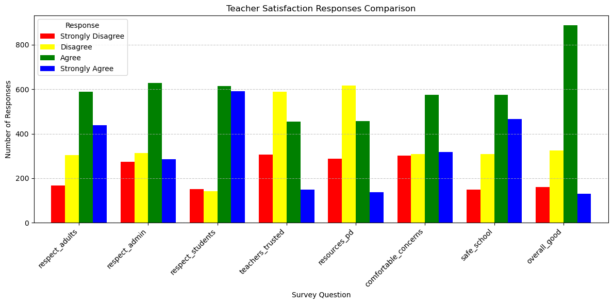

# Teacher Satisfaction Survey Analysis
## This is a brief presentation to determine key factors affecting a school district's teachers satisfaction with their job at their school
# Presentation Slides: https://docs.google.com/presentation/d/1ULMH0F9Wi4yCt3V_3BS9BolJfoVPwxa5AaXgr4eu1mM/edit?usp=sharing
## Analysis was conducted using the provided dataset titled 'Specialist_Interview_Data_052125.xlsx' and visuals were created using PivotTables and the Python library Matplotlib to draw conclusions for improving teacher satisfaction rates.

